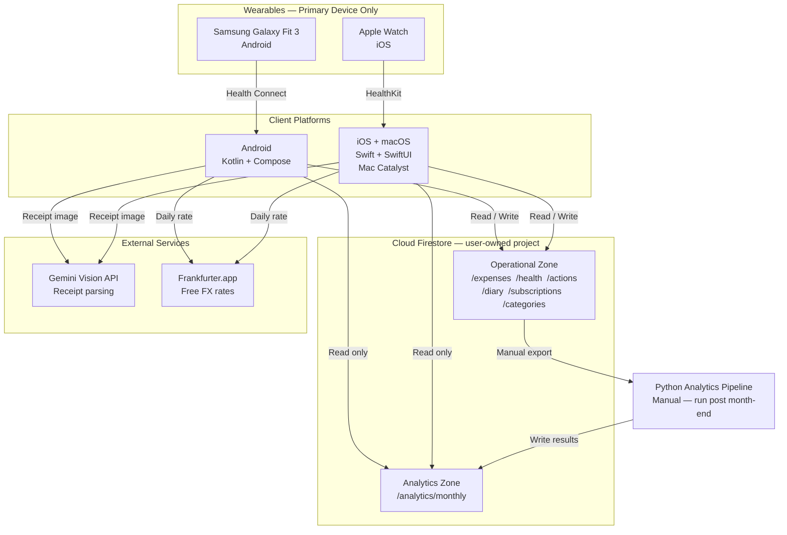
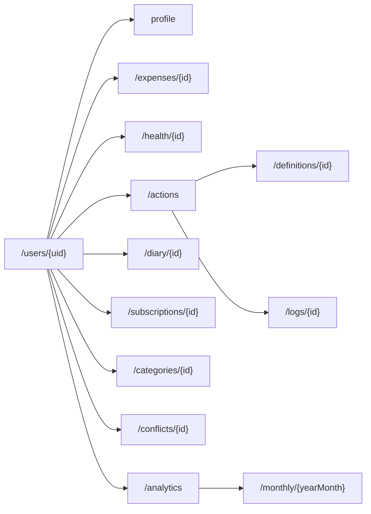
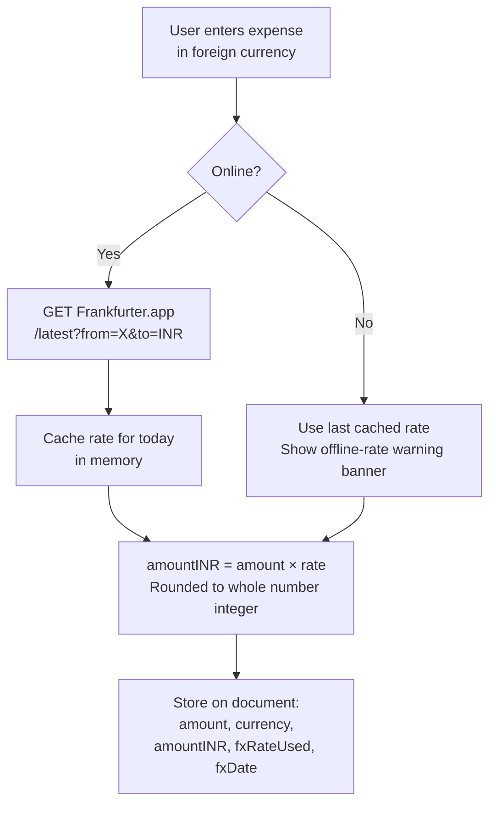
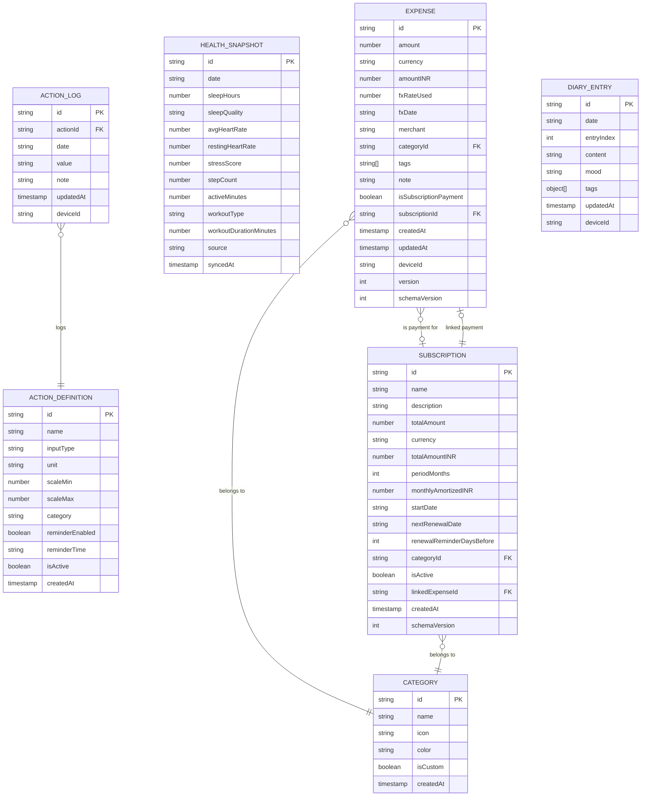
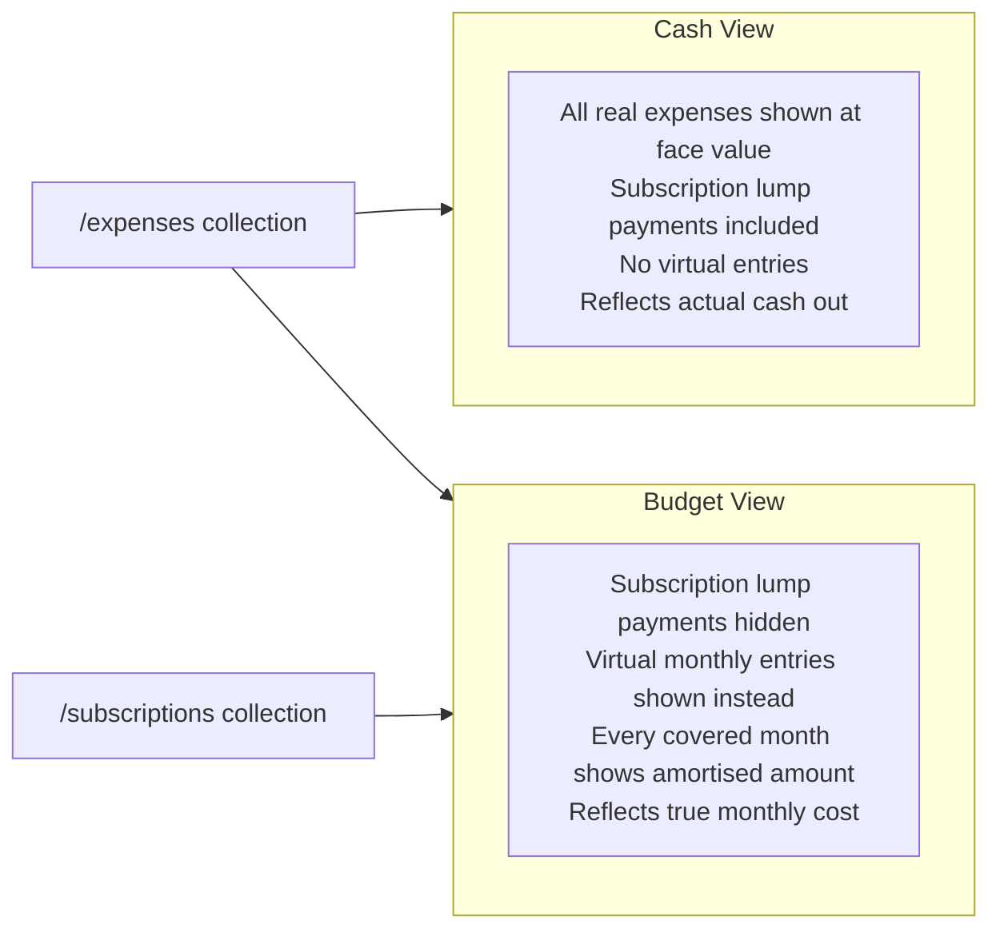
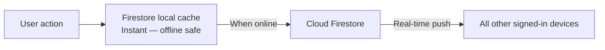
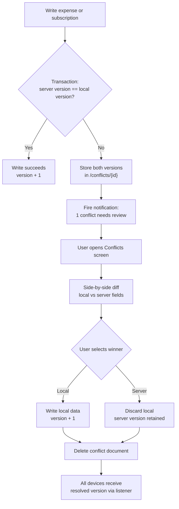
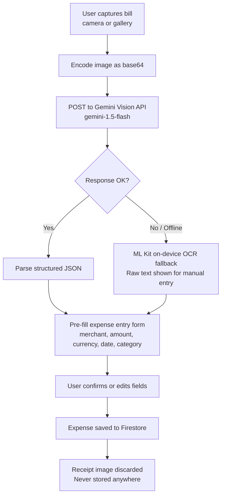
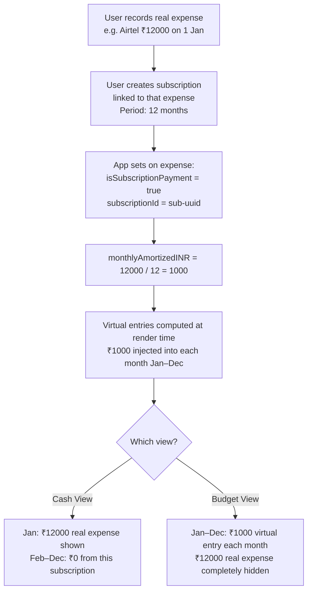
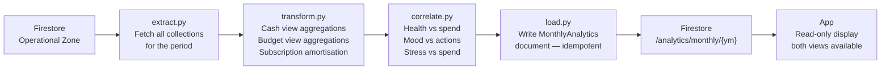

# Shadow Memoir — Architecture Specification

**Version:** 3.0
**Status:** Implementation Ready
**Last Updated:** April 2026

---

## Table of Contents

1. [App Overview](#1-app-overview)
2. [Architecture Overview](#2-architecture-overview)
3. [Tech Stack](#3-tech-stack)
4. [Currency & FX](#4-currency--fx)
5. [Data Model](#5-data-model)
6. [Budget Views](#6-budget-views)
7. [Local Storage & Security](#7-local-storage--security)
8. [Firebase Setup (BYOF)](#8-firebase-setup-byof)
9. [Sync Strategy](#9-sync-strategy)
10. [Conflict Resolution](#10-conflict-resolution)
11. [AI / Receipt Processing](#11-ai--receipt-processing)
12. [Wearable & Health Integration](#12-wearable--health-integration)
13. [Action Tracking](#13-action-tracking)
14. [Subscription Tracking](#14-subscription-tracking)
15. [Diary & Journaling](#15-diary--journaling)
16. [Notifications & Nudges](#16-notifications--nudges)
17. [Export & Analytics](#17-export--analytics)
18. [Offline Behaviour](#18-offline-behaviour)
19. [Project Structure](#19-project-structure)
20. [Future Enhancements](#20-future-enhancements)

---

## 1. App Overview

### Purpose

Shadow Memoir is a native personal life-tracking platform for Android, iOS, and macOS. It serves as a personal operating system — tracking spending, subscriptions, physical health, daily habits, and journal entries in one place, then correlating these across dimensions to surface behavioural insights. All data is privately owned by the user via their own Firebase project; no shared backend exists.

### Core Feature Modules

| Module | Description |
|--------|-------------|
| Expense Tracking | Manual entry and AI-powered bill scanning, multi-currency, INR display |
| Subscription Tracking | Pre-paid and recurring subscriptions with two-view monthly budget |
| Health & Wearables | Sleep, heart rate, steps, workouts from Galaxy Fit 3 / Apple Watch |
| Action Tracking | Fully custom user-defined habits and daily activity logs |
| Diary & Journaling | Multiple daily entries with mood and custom structured tags |
| Analytics | Month-over-month summaries with cross-module correlations |
| Notifications & Nudges | Spend alerts, subscription renewals, action reminders |
| Data Export | CSV and JSON export for external analysis |

### Platforms

| Platform | Language | UI | Notes |
|----------|----------|----|-------|
| Android | Kotlin | Jetpack Compose | Primary mobile platform |
| iOS | Swift | SwiftUI | Full feature parity |
| macOS | Swift | SwiftUI | Mac Catalyst — same iOS codebase, no separate target |

---

## 2. Architecture Overview

### System Architecture



### Firestore Collection Structure



### Key Principles

- **Offline-first** — all reads and writes go to Firestore's local cache first; network is optional
- **Privacy-first** — each user owns their Firebase project (BYOF); zero shared infrastructure
- **One-directional data ownership** — app writes only to the operational zone; Python pipeline writes only to the analytics zone; neither crosses the boundary
- **Single source of truth** — Firestore is never archived or pruned; all data retained indefinitely
- **Health from primary device only** — only the designated primary device polls and writes health snapshots
- **Selective conflict resolution** — expenses use manual resolution; diary and action logs use last-write-wins

---

## 3. Tech Stack

### Android

| Concern | Library / Tool |
|---------|----------------|
| Language | Kotlin |
| UI | Jetpack Compose |
| Dependency Injection | Hilt |
| Database / Sync | Firebase Android SDK (offline persistence enabled) |
| Authentication | Firebase Auth + Google Sign-in |
| Health data | Health Connect API |
| Background tasks | WorkManager |
| Camera | CameraX |
| FX rates | Frankfurter.app via Ktor HTTP client |
| Credential storage | EncryptedSharedPreferences (Jetpack Security / Android Keystore) |

### iOS + macOS (Mac Catalyst)

| Concern | Library / Tool |
|---------|----------------|
| Language | Swift |
| UI | SwiftUI |
| Database / Sync | Firebase iOS SDK (offline persistence enabled) |
| Authentication | Firebase Auth + Google Sign-in |
| Health data | HealthKit — iOS only, guarded by `#if !targetEnvironment(macCatalyst)` |
| Background tasks | BGTaskScheduler — iOS only |
| Camera | AVFoundation / PhotosUI |
| FX rates | Frankfurter.app via URLSession |
| Credential storage | Keychain Services |

> **macOS via Mac Catalyst:** The iOS app binary runs on macOS with one checkbox in Xcode. Health polling, background tasks, and wearable sync are disabled on the macOS target via compile-time guards. Health data and action reminders are visible read-only via Firestore sync from the iOS primary device.

### Shared / External

| Concern | Tool |
|---------|------|
| Cloud database | Cloud Firestore (user-provisioned) |
| AI receipt parsing | Gemini Vision API (`gemini-1.5-flash`) |
| FX rate source | `api.frankfurter.app` (free, no API key required) |
| Analytics pipeline | Python 3 — `pandas`, `scipy`, `firebase-admin` |

---

## 4. Currency & FX

### Default Currency

Shadow Memoir's default display currency is **INR**. The user may change this in **Settings → Currency**. The selected currency is stored in the `profile` document and applied across all views. The underlying `amountINR` conversion always happens regardless of the display currency chosen.

### FX Conversion Flow



### FX API Calls

```
# Live rate
GET https://api.frankfurter.app/latest?from=USD&to=INR

# Historical rate (when editing a past expense)
GET https://api.frankfurter.app/2025-03-14?from=GBP&to=INR
```

### Conversion Rules

- `amountINR` is always a whole integer — `Math.round(amount × rate)`
- Original `amount` and `currency` are always preserved verbatim
- `fxRateUsed` and `fxDate` are stored on every document so historical conversions are reproducible
- INR-denominated expenses store `fxRateUsed: 1.0`, `currency: "INR"`, `amountINR == amount`
- One rate fetch per currency pair per calendar day; subsequent expenses that day reuse the cached rate

---

## 5. Data Model

### Core Entity Relationships



---

### Entity: Expense

```json
{
  "id": "uuid-v4",
  "amount": 50.00,
  "currency": "USD",
  "amountINR": 4169,
  "fxRateUsed": 83.38,
  "fxDate": "2025-03-14",
  "merchant": "Amazon",
  "category": "shopping",
  "tags": ["online", "electronics"],
  "note": "Charging cable",
  "isSubscriptionPayment": false,
  "subscriptionId": null,
  "createdAt": "Firestore Timestamp",
  "updatedAt": "Firestore Timestamp",
  "deviceId": "device-uuid",
  "version": 1,
  "schemaVersion": 1
}
```

> Receipt images are **not stored**. The image is sent to Gemini, data extracted, and the image immediately discarded.

---

### Entity: HealthSnapshot

One document per calendar day. Written only by the primary device. Upserted on each health poll — safe to run multiple times.

```json
{
  "id": "uuid-v4",
  "date": "2025-03-14",
  "sleepHours": 6.5,
  "sleepQuality": "fair",
  "avgHeartRate": 74,
  "restingHeartRate": 61,
  "stressScore": 65,
  "stepCount": 9200,
  "activeMinutes": 42,
  "workoutType": "running",
  "workoutDurationMinutes": 35,
  "source": "HealthConnect",
  "syncedAt": "Firestore Timestamp"
}
```

---

### Entity: ActionDefinition

```json
{
  "id": "uuid-v4",
  "name": "Did I code today?",
  "inputType": "boolean",
  "unit": null,
  "scaleMin": null,
  "scaleMax": null,
  "category": "productivity",
  "reminderEnabled": true,
  "reminderTime": "21:00",
  "isActive": true,
  "createdAt": "Firestore Timestamp"
}
```

**Supported `inputType` values:**

| Type | UI Control | Stored `value` example |
|------|-----------|----------------------|
| `boolean` | Toggle switch | `"true"` |
| `number` | Numeric input + unit label | `"42"` |
| `duration` | Hour / minute picker | `"01:30"` |
| `text` | Multi-line text field | `"Finished the auth module"` |
| `scale` | Slider from `scaleMin` to `scaleMax` | `"7"` |

---

### Entity: ActionLog

One document per action per day. **Last-write-wins** — no version field, no conflict detection. The document ID is deterministic: `{actionId}_{date}` to enforce uniqueness and enable safe upserts.

```json
{
  "id": "action-uuid_2025-03-14",
  "actionId": "action-definition-uuid",
  "date": "2025-03-14",
  "value": "true",
  "note": "Worked on the auth module",
  "updatedAt": "Firestore Timestamp",
  "deviceId": "device-uuid"
}
```

---

### Entity: DiaryEntry

Multiple entries per day. **Last-write-wins** — no version field. `entryIndex` is 0-based and assigned at creation time for ordering within a day.

```json
{
  "id": "uuid-v4",
  "date": "2025-03-14",
  "entryIndex": 0,
  "content": "Free-form journal text...",
  "mood": "motivated",
  "tags": [
    { "type": "energy", "value": 8 },
    { "type": "gratitude", "value": "Good focus today" },
    { "type": "reflection", "value": "Should sleep earlier" },
    { "type": "custom", "label": "deep-work-hours", "value": "3" }
  ],
  "updatedAt": "Firestore Timestamp",
  "deviceId": "device-uuid"
}
```

**Mood values:** `happy` `motivated` `calm` `neutral` `tired` `anxious` `frustrated` `sad` `grateful` `excited`

---

### Entity: Subscription

```json
{
  "id": "uuid-v4",
  "name": "Airtel Yearly Plan",
  "description": "Mobile plan — prepaid annual",
  "totalAmount": 12000,
  "currency": "INR",
  "totalAmountINR": 12000,
  "periodMonths": 12,
  "monthlyAmortizedINR": 1000,
  "startDate": "2025-01-01",
  "nextRenewalDate": "2026-01-01",
  "renewalReminderDaysBefore": 7,
  "categoryId": "utilities",
  "isActive": true,
  "linkedExpenseId": "expense-uuid",
  "createdAt": "Firestore Timestamp",
  "schemaVersion": 1
}
```

**Supported `periodMonths`:** `1`, `3`, `6`, `12`, or any custom integer entered by the user.

---

### Entity: MonthlyAnalytics

Stored at `/users/{uid}/analytics/monthly/2025-03`. **Read-only from the app.** Stores both budget views so the app displays either without recomputing.

```json
{
  "schemaVersion": 1,
  "period": "2025-03",
  "generatedAt": "Firestore Timestamp",
  "generatedBy": "python-pipeline-v1",
  "cashView": {
    "totalSpendINR": 48200,
    "byCategory": {
      "groceries": 12000,
      "transport": 3400,
      "subscriptions": 12000,
      "shopping": 18000,
      "other": 2800
    },
    "avgDailySpendINR": 1555,
    "topMerchants": [
      { "name": "BigBasket", "totalINR": 6200, "visits": 8 }
    ]
  },
  "budgetView": {
    "totalSpendINR": 38200,
    "byCategory": {
      "groceries": 12000,
      "transport": 3400,
      "subscriptions_virtual": 1000,
      "shopping": 18000,
      "other": 2800
    },
    "avgDailySpendINR": 1232,
    "topMerchants": [
      { "name": "BigBasket", "totalINR": 6200, "visits": 8 }
    ]
  },
  "healthCorrelations": {
    "avgSleepHours": 6.2,
    "highSpendLowSleepDays": 7,
    "spendVsStressPearsonR": 0.61
  },
  "actionSummary": {
    "codingDays": 18,
    "avgProductivityScale": 7.2
  },
  "moodSummary": {
    "dominantMood": "motivated",
    "avgEnergyLevel": 6.8,
    "moodDistribution": {
      "motivated": 10,
      "calm": 8,
      "tired": 7,
      "anxious": 5
    }
  },
  "vsLastMonth": {
    "cashViewDeltaINR": 3200,
    "budgetViewDeltaINR": 1800,
    "cashViewDeltaPercent": 7.1,
    "budgetViewDeltaPercent": 4.9
  },
  "anomalies": [
    {
      "date": "2025-03-14",
      "amountINR": 8900,
      "zScore": 3.2,
      "merchant": "Croma"
    }
  ]
}
```

---

### Entity: Profile

```json
{
  "uid": "firebase-auth-uid",
  "primaryDeviceId": "device-uuid",
  "defaultCurrency": "INR",
  "devices": [
    {
      "id": "device-uuid",
      "name": "My Pixel 9",
      "platform": "android",
      "registeredAt": "Firestore Timestamp"
    }
  ],
  "createdAt": "Firestore Timestamp"
}
```

---

## 6. Budget Views

Shadow Memoir presents two distinct views of monthly spending. Both are available wherever monthly totals are shown — the expense list, monthly summary cards, and analytics reports.

### View Definitions



### Cash View — Rules

- Displays all expense documents exactly as stored
- Subscription lump payments (`isSubscriptionPayment: true`) appear at full value
- No virtual entries of any kind
- Represents the actual money that left the account in that month

### Budget View — Rules

- Expense documents where `isSubscriptionPayment: true` are **completely excluded** from all totals and lists
- For each active subscription, a **virtual entry** of `monthlyAmortizedINR` is computed and injected into every calendar month within `[startDate, nextRenewalDate)`
- Virtual entries are computed in-app at render time from subscription documents — they are **not stored** in Firestore
- All totals and category breakdowns are recalculated using this substituted dataset
- Represents the smoothed monthly cost as if the subscription were billed monthly

### Worked Example

Subscription: Airtel Yearly Plan — ₹12,000 paid on 1 Jan 2025, covering 12 months.

| Month | Cash View | Budget View |
|-------|-----------|-------------|
| Jan 2025 | ₹12,000 (real expense) | ₹1,000 (virtual) |
| Feb 2025 | ₹0 from this subscription | ₹1,000 (virtual) |
| Mar–Dec 2025 | ₹0 from this subscription | ₹1,000 (virtual) each |

### View Switcher

A persistent toggle at the top of the monthly expense screen and analytics summary switches between Cash View and Budget View. The selected view is remembered per session but not persisted — the app defaults to Budget View on launch.

---

## 7. Local Storage & Security

### Storage Approach

Firestore's built-in offline persistence is the sole local data store. No secondary local database is used. The SDK manages the cache transparently.

### Credential Encryption

| Platform | Mechanism |
|----------|-----------|
| Android | `EncryptedSharedPreferences` backed by Android Keystore (hardware-backed) |
| iOS / macOS | Keychain Services with `kSecAttrAccessibleAfterFirstUnlock` |

### What Is Stored in Secure Storage

- Firebase project credentials (`projectId`, `applicationId`, `apiKey`, `storageBucket`)
- Google Sign-in session tokens (managed by Firebase Auth SDK)

### What Is Explicitly Not Stored

- Receipt images — discarded immediately after Gemini extraction completes
- FX rates — cached in memory for the session only, never persisted

---

## 8. Firebase Setup (BYOF)

### One-Time Setup Per User

1. Create a project at [console.firebase.google.com](https://console.firebase.google.com)
2. Enable **Cloud Firestore** in production mode
3. Enable **Authentication** → Google Sign-in provider
4. Project Settings → add Android / iOS app → note config values
5. Apply Security Rules below

### Security Rules

```javascript
rules_version = '2';
service cloud.firestore {
  match /databases/{database}/documents {
    match /users/{uid}/{document=**} {
      allow read, write: if request.auth != null && request.auth.uid == uid;
    }
  }
}
```

### Dynamic Initialisation

**Android (Kotlin):**
```kotlin
val options = FirebaseOptions.Builder()
    .setProjectId(config.projectId)
    .setApplicationId(config.applicationId)
    .setApiKey(config.apiKey)
    .setStorageBucket(config.storageBucket)
    .build()
FirebaseApp.initializeApp(context, options)
```

**iOS / macOS (Swift):**
```swift
let options = FirebaseOptions(googleAppID: config.appID, gcmSenderID: config.senderID)
options.projectID = config.projectID
options.apiKey = config.apiKey
options.storageBucket = config.storageBucket
FirebaseApp.configure(options: options)
```

### Adding a Second Device

Primary device: **Settings → Devices → Share Config** generates a QR code containing the Firebase config JSON. Second device scans it, fields auto-populate, then Google Sign-in completes setup.

### Primary Device

Set via **Settings → Devices → Set as Primary**. Stored as `primaryDeviceId` in `profile`. Governs:
- Health data polling — only primary writes `HealthSnapshot` documents
- Scheduled notifications — daily/weekly nudges, subscription renewals, action reminders
- Conflict notifications — primary device surfaces unresolved conflict reminders after 7 days

---

## 9. Sync Strategy

### Data Flow



All reads and writes are served from the Firestore SDK local cache first. When online, the SDK syncs pending writes and pushes remote changes via real-time listeners. No custom sync logic is required.

The app displays a sync status indicator using `FirebaseFirestore.waitForPendingWrites()` when unsynced writes exist.

---

## 10. Conflict Resolution

Conflict behaviour differs by entity type.

| Entity | Strategy | Reason |
|--------|----------|--------|
| Expense | Manual — version transaction + side-by-side diff | Financial data must not be silently overwritten |
| Subscription | Manual — version transaction | Financial record, same risk as expense |
| ActionLog | Last-write-wins | One log per day, low consequence, simple |
| DiaryEntry | Last-write-wins | Personal notes, user prefers simplicity |
| HealthSnapshot | Primary device only — no conflict possible | Single writer |
| MonthlyAnalytics | Pipeline only — no conflict possible | Single writer |

### Expense & Subscription Conflict Flow



### Last-Write-Wins (ActionLog, DiaryEntry)

These documents are written with a plain `.set()` call — no transaction, no version check. The Firestore server applies the write with the latest server timestamp. If two devices write offline and reconnect, Firestore's internal ordering resolves the collision — the later server-received write wins. No user action is required.

---

## 11. AI / Receipt Processing

### Processing Flow



### Gemini Prompt

```
Extract the following fields from this receipt image.
Return ONLY valid JSON with no additional text. Use null for any missing field.

{
  "merchant": "string",
  "totalAmount": number,
  "currency": "ISO-4217 code",
  "date": "YYYY-MM-DD",
  "category": "one of: groceries, dining, transport, shopping, utilities,
               health, travel, entertainment, education, subscriptions, other",
  "lineItems": [
    { "description": "string", "amount": number }
  ]
}
```

---

## 12. Wearable & Health Integration

### Data Sources by Platform

| Platform | API | Wearable | Writes Health Data |
|----------|-----|----------|--------------------|
| Android primary | Health Connect API | Samsung Galaxy Fit 3 via Samsung Health | Yes |
| iOS primary | HealthKit | Apple Watch | Yes |
| macOS Catalyst | None | None | No — read-only via Firestore |
| Any secondary device | None | None | No — health sync skipped |

Before each health poll, the device reads `primaryDeviceId` from the cached `profile` document. If it does not match the current device ID, the poll is skipped silently.

### Data Collected

| Field | Android (Health Connect) | iOS (HealthKit) |
|-------|--------------------------|-----------------|
| `sleepHours`, `sleepQuality` | `SleepSessionRecord` | `HKCategoryTypeIdentifierSleepAnalysis` |
| `avgHeartRate`, `restingHeartRate` | `HeartRateRecord` | `HKQuantityTypeIdentifierHeartRate` |
| `stepCount` | `StepsRecord` | `HKQuantityTypeIdentifierStepCount` |
| `activeMinutes` | `ExerciseSessionRecord` | `HKQuantityTypeIdentifierAppleExerciseTime` |
| `workoutType`, `workoutDurationMinutes` | `ExerciseSessionRecord` | `HKWorkoutType` |

### Sync Schedule

Polled every **4 hours** on the primary device only:
- Android: `WorkManager` `PeriodicWorkRequest`
- iOS: `BGAppRefreshTask`

Each poll fetches the prior 24 hours and upserts the `HealthSnapshot` document for that `date`. Repeated polls are idempotent.

---

## 13. Action Tracking

### Concept

The user creates fully custom actions with a name, input type, and optional daily reminder. One log entry is recorded per action per day. The app shows a daily checklist and historical trends per action.

### Creating an Action — Fields

| Field | Type | Description |
|-------|------|-------------|
| `name` | string | e.g. "Did I code today?" |
| `inputType` | enum | `boolean`, `number`, `duration`, `text`, `scale` |
| `unit` | string | Optional — e.g. "pages", "km", "glasses" |
| `scaleMin`, `scaleMax` | integer | Required for `scale` type |
| `category` | string | `productivity`, `health`, `personal`, or any custom label |
| `reminderEnabled` | boolean | Whether to fire a daily reminder |
| `reminderTime` | string | HH:MM in user's local timezone — set per action |

### Input Type Rendering

| `inputType` | UI Control | Stored `value` |
|-------------|-----------|----------------|
| `boolean` | Toggle switch | `"true"` or `"false"` |
| `number` | Numeric field + unit label | `"42"` |
| `duration` | HH:MM picker | `"01:30"` |
| `text` | Multi-line text field | Raw string |
| `scale` | Slider with min / max labels | `"7"` |

### Log Upsert Key

`ActionLog` documents use the deterministic ID `{actionId}_{date}` (e.g. `abc123_2025-03-14`). This enforces one entry per action per day and makes upserts safe — re-logging an action on the same day simply overwrites the existing document.

---

## 14. Subscription Tracking

### Amortisation Flow



### Renewal Reminders

The primary device checks all active subscriptions daily via WorkManager / BGTaskScheduler. A reminder notification fires `renewalReminderDaysBefore` days before `nextRenewalDate`. Each subscription configures this independently. The notification prompts the user to decide whether to renew and record the new payment.

### Renewal Workflow

When a subscription renews the user:
1. Records the new payment as a fresh expense
2. Opens the subscription in Settings → Subscriptions → Renew
3. Links the new expense, updates `startDate` and `nextRenewalDate`

The old linked expense remains in history unchanged.

---

## 15. Diary & Journaling

### Concept

Multiple diary entries can be written per calendar day. Each entry has free-form text content, a mood selection, and one or more structured tags. There is no length limit on content.

### Entry Tags

| Tag `type` | Value format | Example |
|-----------|-------------|---------|
| `energy` | Integer 1–10 | Energy: 7 |
| `gratitude` | Free text | "Good focus today" |
| `reflection` | Free text | "Should sleep earlier" |
| `custom` | User-defined `label` + free text or integer | "deep-work-hours": "3" |

### Conflict Strategy

Diary entries use **last-write-wins**. No version check is performed on write. The document is overwritten with the latest content. If two devices edit the same entry while offline, the version received last by the Firestore server is kept. This is acceptable for personal notes where the cost of a manual resolution workflow exceeds the benefit.

---

## 16. Notifications & Nudges

### Notification Types

| Notification | Trigger | Device Scope |
|-------------|---------|--------------|
| Daily spend check | 8:00 PM daily | Primary device only |
| Weekly summary | Sunday 9:00 AM | Primary device only |
| Budget nudge | Daily spend > 1.5× 30-day average | Primary device only |
| Subscription renewal | N days before `nextRenewalDate` (per subscription) | Primary device only |
| Action reminder | Per-action `reminderTime` if `reminderEnabled` | Primary device only |
| Conflict alert | On conflict detection at write time | Any detecting device |

### Implementation

**Android:** `WorkManager` for scheduling, `NotificationManager` for delivery. Galaxy Fit 3 mirrors all phone notifications via Bluetooth automatically.

**iOS:** `BGTaskScheduler` for scheduling, `UNUserNotificationCenter` for delivery. Apple Watch mirrors all iPhone notifications automatically.

**macOS (Catalyst):** Receives Firestore-triggered conflict notifications via macOS Notification Centre. Scheduled nudges (WorkManager / BGTask) do not fire on macOS.

### Primary Device Guard

Before firing any scheduled notification, the app reads `primaryDeviceId` from the cached `profile` document. If the current device ID does not match, the notification is suppressed silently.

---

## 17. Export & Analytics

### In-App Export

Triggered from **Settings → Export Data**. Reads from Firestore local cache — works fully offline. Delivered via system share sheet.

| Format | Contents |
|--------|---------|
| CSV | Expenses, health snapshots, action logs, diary entries joined by date |
| JSON | Full operational zone collection dump |

**CSV schema:**
```
id, date, merchant, category, tags, amount, currency, amount_inr,
fx_rate_used, fx_date, is_subscription_payment, subscription_id,
sleep_hours, sleep_quality, avg_heart_rate, resting_heart_rate,
stress_score, step_count, active_minutes, workout_type,
workout_duration_minutes, diary_mood, diary_energy_level
```

### Analytics Pipeline



The pipeline is run manually at any time after a month closes. Running it twice for the same period safely overwrites the same document.

**Pipeline directory:**
```
pipeline/
├── config.py         # Firebase credentials, UID, pipeline version
├── extract.py        # Fetch expenses, health, actions, diary, subscriptions
├── transform.py      # Both budget view aggregations + subscription amortisation logic
├── correlate.py      # Cross-module correlation computations
├── load.py           # Write to /analytics/monthly/{yearMonth}
├── run.py            # Entry point: extract → transform → correlate → load
└── requirements.txt  # firebase-admin, pandas, scipy
```

---

## 18. Offline Behaviour

| Feature | Offline Behaviour |
|---------|------------------|
| View expenses (both views) | Full — Firestore cache |
| Add / edit expense | Full — queued for sync |
| View / create subscriptions | Full — virtual entries computed from cached subscription docs |
| Log an action | Full — queued for sync |
| Write diary entry | Full — queued for sync |
| View monthly analytics | Full — analytics docs are cached |
| Export CSV / JSON | Full — reads local cache |
| Bill scanning (AI) | Partial — ML Kit OCR fallback |
| Health data polling | Deferred — runs when online |
| FX rate fetch | Uses last in-memory cached rate + warning banner |
| Conflict resolution | Full — conflict docs are cached |
| Subscription renewal notifications | Deferred — notification fires when device is online and BGTask runs |

### Sync Recovery

On reconnection the Firestore SDK flushes all pending writes in creation order. Any write that triggers a version mismatch on an expense or subscription creates a conflict document. New conflicts surface as notifications on the detecting device.

---

## 19. Project Structure

### Android

```
app/
├── data/
│   ├── firebase/
│   │   ├── FirebaseManager.kt
│   │   ├── ExpenseRepository.kt
│   │   ├── HealthRepository.kt
│   │   ├── ActionRepository.kt
│   │   ├── DiaryRepository.kt
│   │   ├── SubscriptionRepository.kt
│   │   ├── AnalyticsRepository.kt
│   │   └── ConflictRepository.kt
│   ├── health/
│   │   └── HealthConnectManager.kt
│   ├── ai/
│   │   └── GeminiReceiptParser.kt
│   ├── fx/
│   │   └── FxRateService.kt
│   ├── export/
│   │   └── ExportManager.kt
│   └── preferences/
│       └── EncryptedConfigStore.kt
├── domain/
│   ├── model/
│   │   ├── Expense.kt
│   │   ├── HealthSnapshot.kt
│   │   ├── ActionDefinition.kt
│   │   ├── ActionLog.kt
│   │   ├── DiaryEntry.kt
│   │   ├── Subscription.kt
│   │   └── MonthlyAnalytics.kt
│   └── usecase/
│       ├── SaveExpenseUseCase.kt
│       ├── GetBudgetViewUseCase.kt
│       ├── GetCashViewUseCase.kt
│       ├── LogActionUseCase.kt
│       ├── SaveDiaryEntryUseCase.kt
│       ├── ResolveConflictUseCase.kt
│       ├── SyncHealthDataUseCase.kt
│       └── ComputeVirtualEntriesUseCase.kt
├── ui/
│   ├── onboarding/
│   ├── expenses/
│   ├── scanner/
│   ├── subscriptions/
│   ├── actions/
│   ├── diary/
│   ├── analytics/
│   ├── conflicts/
│   └── settings/
├── workers/
│   ├── HealthSyncWorker.kt
│   ├── NudgeWorker.kt
│   ├── ActionReminderWorker.kt
│   └── SubscriptionRenewalWorker.kt
└── di/
    └── AppModule.kt
```

### iOS + macOS

```
ShadowMemoir/
├── Data/
│   ├── Firebase/
│   │   ├── FirebaseManager.swift
│   │   ├── ExpenseRepository.swift
│   │   ├── HealthRepository.swift
│   │   ├── ActionRepository.swift
│   │   ├── DiaryRepository.swift
│   │   ├── SubscriptionRepository.swift
│   │   ├── AnalyticsRepository.swift
│   │   └── ConflictRepository.swift
│   ├── Health/
│   │   └── HealthKitManager.swift       # iOS only — #if !targetEnvironment(macCatalyst)
│   ├── AI/
│   │   └── GeminiReceiptParser.swift
│   ├── FX/
│   │   └── FxRateService.swift
│   └── Export/
│       └── ExportManager.swift
├── Domain/
│   ├── Models/
│   │   ├── Expense.swift
│   │   ├── HealthSnapshot.swift
│   │   ├── ActionDefinition.swift
│   │   ├── ActionLog.swift
│   │   ├── DiaryEntry.swift
│   │   ├── Subscription.swift
│   │   └── MonthlyAnalytics.swift
│   └── UseCases/
│       ├── SaveExpenseUseCase.swift
│       ├── GetBudgetViewUseCase.swift
│       ├── GetCashViewUseCase.swift
│       ├── LogActionUseCase.swift
│       ├── SaveDiaryEntryUseCase.swift
│       ├── ResolveConflictUseCase.swift
│       ├── SyncHealthDataUseCase.swift
│       └── ComputeVirtualEntriesUseCase.swift
├── UI/
│   ├── Onboarding/
│   ├── Expenses/
│   ├── Scanner/
│   ├── Subscriptions/
│   ├── Actions/
│   ├── Diary/
│   ├── Analytics/
│   ├── Conflicts/
│   └── Settings/
└── BackgroundTasks/
    ├── HealthSyncTask.swift              # iOS only
    ├── NudgeTask.swift
    ├── ActionReminderTask.swift
    └── SubscriptionRenewalTask.swift
```

### Python Analytics Pipeline

```
pipeline/
├── config.py
├── extract.py
├── transform.py
├── correlate.py
├── load.py
├── run.py
└── requirements.txt
```

---

## 20. Future Enhancements

The following are explicitly out of scope for v1.0 and should be planned as separate work items.

- **Per-category monthly budgets** — set spend limits with threshold notifications
- **Recurring expense auto-detection** — suggest flagging regular merchants as subscriptions
- **Goal tracking per action** — e.g. "code at least 20 days this month" with progress bar
- **Mood vs spend overlay chart** — visual correlation of diary mood with daily spend
- **Automated analytics pipeline** — replace manual Python script with Firebase Cloud Function or home-server cron once schema is stable
- **Apple Watch / Wear OS native companion** — quick expense entry and action logging from wrist
- **Web dashboard** — read-only browser analytics view using the same Firestore project
- **Receipt OCR search history** — store extracted text (not image) to enable past bill search
- **iCloud backup of Firebase config** — simplified device restoration on iOS
- **Multi-language support** — localisation beyond English
- **FX rate audit export** — full history of rates used, for precise accounting reconciliation
- **Dark mode adaptive charts** — auto-theme all analytics charts to system appearance

---

*Shadow Memoir — Architecture Specification v3.0*
*All implementation decisions are final as of this version. Schema changes or new conflict strategies require a version bump and update to affected sections.*